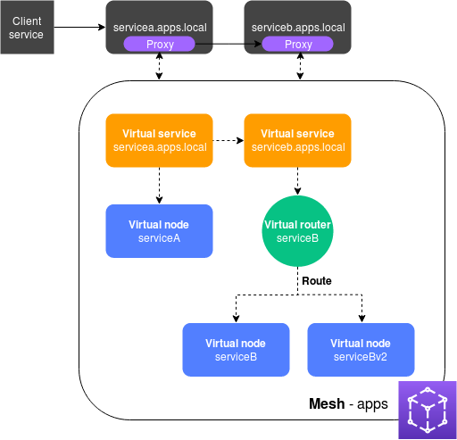

# App Mesh 上手实验

AWS App Mesh是一种易于监控和控制服务的服务网格。服务网格是一个专用于处理服务到服务通信的基础结构层，通常通过与应用程序代码一起部署的轻量级网络代理阵列进行处理。App Mesh 将标准化服务进行通信的方式，从而为您提供端到端可见性并有助于确保您的应用程序的高可用性。App Mesh 为您提供对应用程序中的每个服务的一致可见性和网络流量控制。

在此配置中，服务不再直接相互通信。相反，它们通过代理相互通信。使用servicea.apps.local服务读取应用 Mesh 配置并将流量发送到serviceb.apps.local或者servicebv2.apps.local，取决于配置。

以下实验将向您展示了在不同计算环境中实际使用的AWS App Mesh，并演示了与其他AWS服务（例如CloudWatch和X-Ray）的集成。

实验会分为以下部分，分别是EKS环境的搭建，和App Mesh功能介绍

## EKS

以下文章展示在EKS上使用App Mesh

* [在EKS中使用App Mesh](./eks/)

## 功能

以下文章展示了如何使用App Mesh功能

### App Mesh 路由功能

* [基于HTTP Header的路由和路由优先级](./howto-k8s-http-headers)
* [使用和管理HTTP2 路由](./howto-k8s-http2)
* [使用App Mesh管理gRPC路由](./howto-k8s-grpc)

### App Mesh 网络功能

* [使用App Mesh设置HTTP重试策略](./howto-k8s-retry-policy)
* [使用App Mesh设置HTTP超时策略](./howto-k8s-timeout-policy)
* [使用App Mesh VirtualGateway处理入口流量](./howto-k8s-ingress-gateway)
* [使用App Mesh访问外部服务](./howto-k8s-egress)
* [使用App Mesh配置连接池实现熔断](./howto-k8s-connection-pools)
* [使用App Mesh进行异常检测](./howto-k8s-outlier-detection)
<!-- * ./howto-k8s-cross-cluster -->

### App Mesh 与其他服务集成

* [使用ALB访问App Mesh](./howto-k8s-alb)
* [使用AWS Cloud Map进行服务发现](./howto-k8s-cloudmap)
<!-- * howto-k8s-fargate -->

<!-- ### App Mesh 网络安全 -->

<!-- * howto-k8s-tls-acm
* howto-k8s-tls-file-based
* howto-k8s-mtls-file-based
* howto-k8s-mtls-sds-based -->

## 可观测性

以下文章展示了基于EKS的AppMesh系统的可观测性

* [Cloudwatch](./eks/o11y-cloudwatch.md)
* [Prometheus](./eks/o11y-prometheus.md)
* [Grafana](./eks/o11y-grafana.md)
* [X-Ray](./eks/o11y-xray.md)
<!-- * [Jaeger](./eks/o11y-jaeger.md) -->

## Security

See [CONTRIBUTING](CONTRIBUTING.md#security-issue-notifications) for more information.

## License

This library is licensed under the MIT-0 License. See the LICENSE file.
