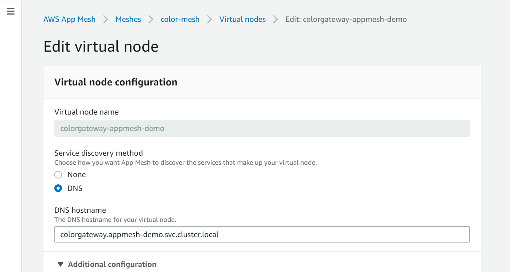
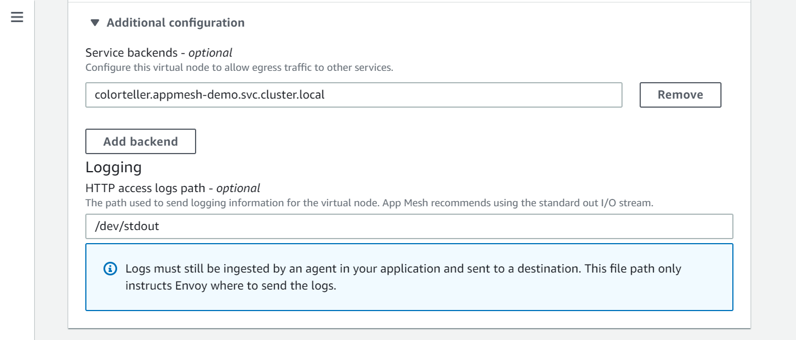
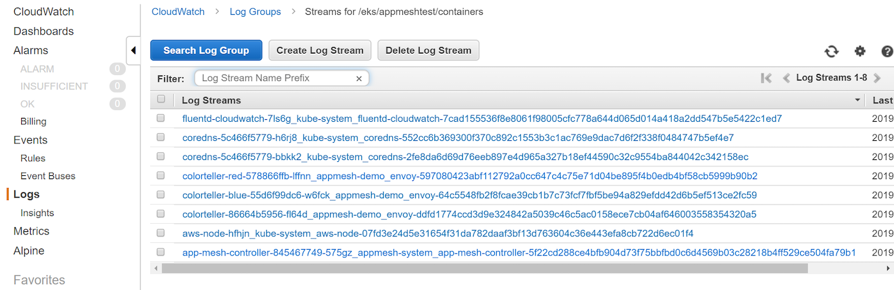

# App Mesh在EKS上的可观测性: CloudWatch

注意：在开始本部分之前，请确保已完成带有EKS的App Mesh的[环境搭建](base.md)。 换句话说，以下假设已配置了App Mesh的EKS群集可用，并且满足先决条件（aws，kubectl，jq等）。

## Prometheus 监控信息

有关Envoy统计信息和Prometheus指标的更多信息，请参见App Mesh User Guide中的[App Mesh Observability: Statistics](https://docs.aws.amazon.com/app-mesh/latest/userguide/observability.html)。

您可以将CloudWatch Agent安装到您的集群并将其配置为从Envoy收集所需指标。要为您的集群设置适当的IAM权限并安装代理，请按照[安装具有 Prometheus 指标收集功能的 CloudWatch 代理](https://docs.aws.amazon.com/AmazonCloudWatch/latest/monitoring/ContainerInsights-Prometheus-Setup.html)中的步骤进行操作。默认安装包含Prometheus抓取配置，使其能提取Envoy统计信息中所需部分。有关更多信息，请参见[App Mesh 的 Prometheus 指标](https://docs.aws.amazon.com/AmazonCloudWatch/latest/monitoring/ContainerInsights-Prometheus-metrics.html#ContainerInsights-Prometheus-metrics-appmesh)。

要创建一个自定义CloudWatch仪表板，显示App Mesh代理程序正在收集的指标，请按照[查看 Prometheus 指标](https://docs.aws.amazon.com/AmazonCloudWatch/latest/monitoring/ContainerInsights-Prometheus-viewmetrics.html)教程中的步骤进行操作。当流量进入App Mesh应用程序时，您的监控仪表板会有所显示。

## 通过Fluentd记录日志

在本节中，将在集群中安装Fluentd，并使用它将Envoy的访问日志转发到CloudWatch。

首先，按照[logs-policy.json](logs-policy.json)中创建一个IAM策略，并将其附加到您的EKS集群的EC2 auto-scaling group。要通过命令行附加IAM策略，请使用：

```
$ INSTANCE_PROFILE_PREFIX=$(aws cloudformation describe-stacks | jq -r '.Stacks[].StackName' | grep eksctl-appmeshtest-nodegroup-ng)
$ INSTANCE_PROFILE_NAME=$(aws iam list-instance-profiles | jq -r '.InstanceProfiles[].InstanceProfileName' | grep $INSTANCE_PROFILE_PREFIX)
$ ROLE_NAME=$(aws iam get-instance-profile --instance-profile-name $INSTANCE_PROFILE_NAME | jq -r '.InstanceProfile.Roles[] | .RoleName')
$ aws iam put-role-policy \
      --role-name $ROLE_NAME \
      --policy-name Worker-Logs-Policy \
      --policy-document file://./logs-policy.json
```

接下来，使用[fluentd.yaml](fluentd.yaml)中定义的`DaemonSet`部署Fluentd，使其作为日志转发器：

```
$ sed "s/AWS_DEFAULT_REGION/$AWS_DEFAULT_REGION/g" fluentd.yaml > fluentd-cn.yaml
$ kubectl apply -f fluentd-cn.yaml

# validate that the Fluentd pods are up and running:
$ kubectl -n kube-system get po -l=k8s-app=fluentd-cloudwatch
NAME                       READY   STATUS    RESTARTS   AGE
fluentd-cloudwatch-7ls6g   1/1     Running   0          13m
fluentd-cloudwatch-mdf9z   1/1     Running   0          13m
```

现在配置虚拟节点（virtual-node）`colorgateway-appmesh-demo`，以便将其日志输出到`stdout`，然后由Fluentd转发到CloudWatch。请使用控制台在虚拟节点`colorgateway-appmesh-demo`上设置日志输出。

首先，在AppMesh控制台中找到虚拟节点`colorgateway-appmesh-demo` ：



现在，展开*日志记录 - 可选*部分，并在*HTTP访问日志路径*中输入`/dev/stdout`，如下所示：



现在，当您转到CloudWatch控制台时，您应该会看到类似以下内容的内容：


