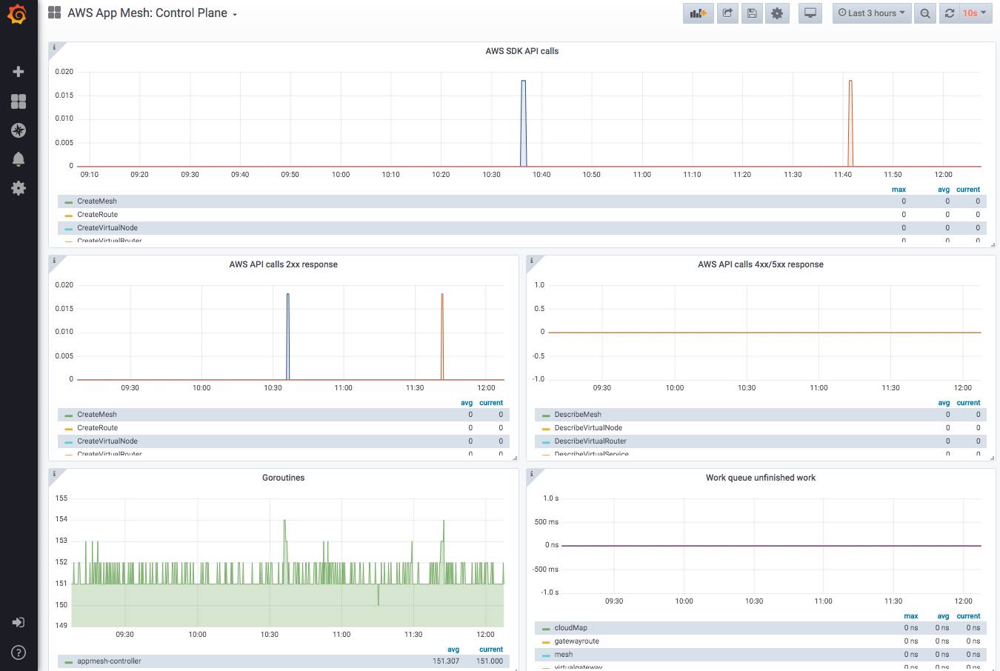
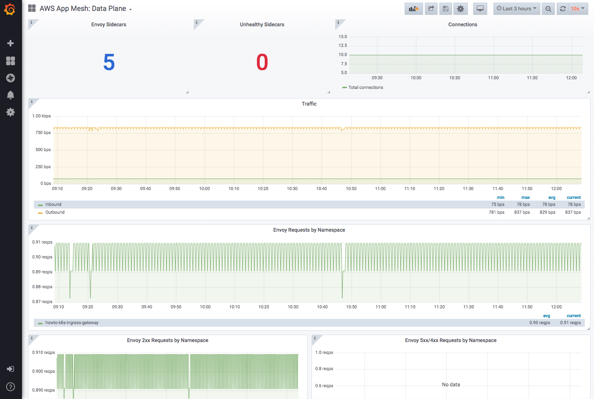

# App Mesh在EKS上的可观测性: Grafana

注意：在开始本部分之前，请确保已完成带有EKS的App Mesh的[环境搭建](base.md)。 换而言之，以下假设已配置了App Mesh的EKS群集可用，并且满足先决条件（aws，kubectl，jq等）。

[Grafana](https://grafana.com/)是一款开源的可视化和分析软件。你可以使用它进行查询，绘制可视化图表，警报和浏览Prometheus或其他监视系统指标。

## 安装

### 选项 1: 快速开始

前提条件:
  * AWS App Mesh [Prometheus](https://github.com/aws/eks-charts/tree/master/stable/appmesh-prometheus)

App Mesh提供了预先的基础，可使用Helm快速部署与 App Mesh 集成的 Grafana：
```
helm upgrade -i appmesh-grafana eks/appmesh-grafana \
--namespace appmesh-system
```
如果想对 Helm charts 进行更多的配置，可以参考：[appmesh-Grafana](https://github.com/aws/eks-charts/blob/master/stable/appmesh-grafana/README.md)

### 选项 2: 使用已经存在的Grafana

如果您已经安装了Grafana，并且对使用App Mesh提供的Grafana dashboard感兴趣，则可以在此处找到这些仪表板[here](https://github.com/aws/eks-charts/tree/master/stable/appmesh-grafana/dashboards)。

## Dashboards

您可以使用Prometheus的监控数据来构建自己的Grafana dashboards。App Mesh为App Mesh Kubernetes Controller和Mesh数据平面提供了预先配置的仪表板。

**Control Plane Dashboard**: 展示App Mesh Kubernetes Controller的运行状况

**Data Plane Dashboard**: 展示Envoy监控指标和健康状况

## 使用

对于测试或演示环境（选项1安装），您可以使用端口转发到Grafana：

```
kubectl -n appmesh-system port-forward svc/appmesh-grafana 3000:3000
```

下图是一个示例控制平面仪表板的视图：



下图是一个示例数据平面仪表板的视图：



## 清除环境

```
helm delete appmesh-grafana -n appmesh-system
```
