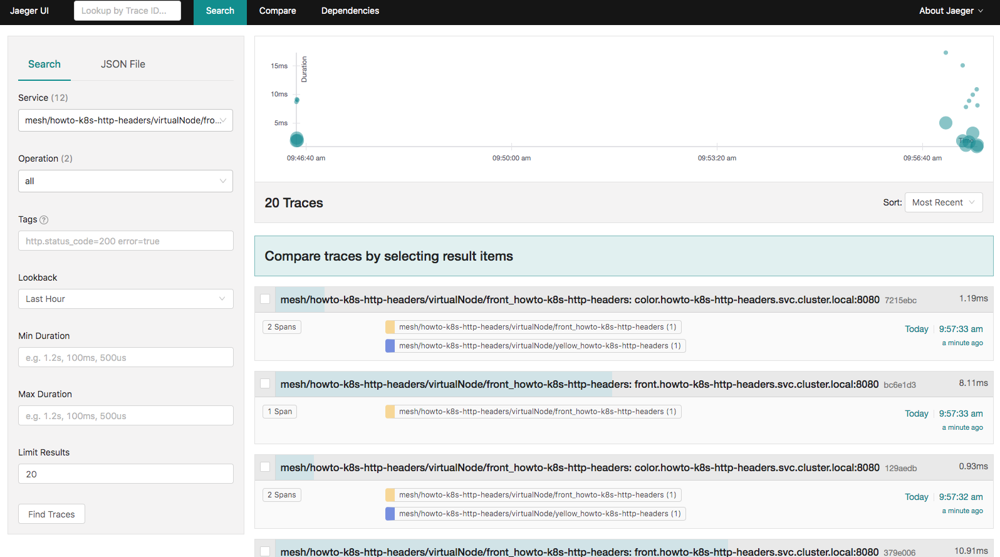
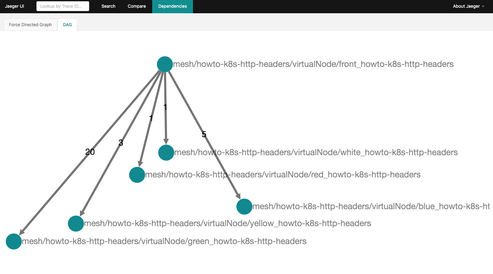

# 已过期！
# App Mesh在EKS上的可观测性: Jaeger

注意：在开始本部分之前，请确保已完成带有EKS的App Mesh的[环境搭建](base.md)。 换句话说，以下假设已配置了App Mesh的EKS群集可用，并且满足先决条件（aws，kubectl，jq等）。

Jaeger是一个端到端的分布式跟踪系统，它使用户可以监视复杂的分布式系统中的事务并进行故障排除。

本指南使用[基于HTTP header路由的示例程序](../howto-k8s-http-headers/)来展示使用Jaeger进行的分布式跟踪。

### 安装

#### 选项 1: 快速开始

App Mesh提供了预先的集成，可使用Helm快速部署与 App Mesh 集成的 Jaeger：
```
helm upgrade -i appmesh-jaeger eks/appmesh-jaeger \
--namespace appmesh-system

helm upgrade -i appmesh-controller eks/appmesh-controller \
    --namespace appmesh-system \
    --set region=$AWS_DEFAULT_REGION \
    --set serviceAccount.create=false \
    --set serviceAccount.name=appmesh-controller \
    --set image.repository=961992271922.dkr.ecr.cn-northwest-1.amazonaws.com.cn/amazon/appmesh-controller \
    --set init.image.repository=919830735681.dkr.ecr.cn-northwest-1.amazonaws.com.cn/aws-appmesh-proxy-route-manager \
    --set init.iamge.tag=v4-prod \
    --set sidecar.image.repository=919830735681.dkr.ecr.cn-northwest-1.amazonaws.com.cn/aws-appmesh-envoy \
    --set sidecar.image.tag=v1.20.0.0-prod \
    --set tracing.enabled=true \
    --set tracing.provider=jaeger \
    --set tracing.address=appmesh-jaeger.appmesh-system \
    --set tracing.port=9411
```

如果想对 Helm charts 进行更多的配置，可以参考：[appmesh-jaeger](https://github.com/aws/eks-charts/blob/master/stable/appmesh-jaeger/README.md)

注意：启用跟踪后，您将需要 _重启_ 网格内的所有正在运行的Pod，以便Envoy边车可以选择跟踪配置

#### 选项 2: 使用已经存在的Jaeger

如果您已经部署了Jaeger，则只需使用以下命令配置App Mesh Kubernetes controller即可将跟踪发送到现有Jaeger中：

```
helm upgrade -i appmesh-controller eks/appmesh-controller \
    --namespace appmesh-system \
    --set tracing.enabled=true \
    --set tracing.provider=jaeger \
    --set tracing.address=<JAEGER_ENDPOINT_ADDR / JAEGER_SERVICE_NAME> \
    --set tracing.port=<JAEGER_ENDPOINT_PORT>
```

App Mesh将配置Envoy生成[Zipkin HTTP JSON v2 format](https://www.jaegertracing.io/docs/1.16/apis/#zipkin-formats-stable)格式得跟踪信息。使用的确切跟踪配置是：
```
tracing:
 http:
  name: envoy.tracers.zipkin
  typed_config:
   "@type": type.googleapis.com/envoy.config.trace.v2.ZipkinConfig
   collector_cluster: jaeger
   collector_endpoint: "/api/v2/spans"
   collector_endpoint_version: HTTP_JSON
   shared_span_context: false
```


### 使用

对于测试或演示环境（选项1安装），您可以使用端口转发到Jaeger：

```
kubectl -n appmesh-system port-forward svc/appmesh-jaeger 16686:16686
```

访问Jaeger UI: http://localhost:16686/

您可以在左上角的下拉列表中查看服务列表，并查看其相应的跟踪记录：



您可以在“Dependencies”选项卡下看到依赖关系图：




### 清理环境

```
helm delete appmesh-jaeger -n appmesh-system
```