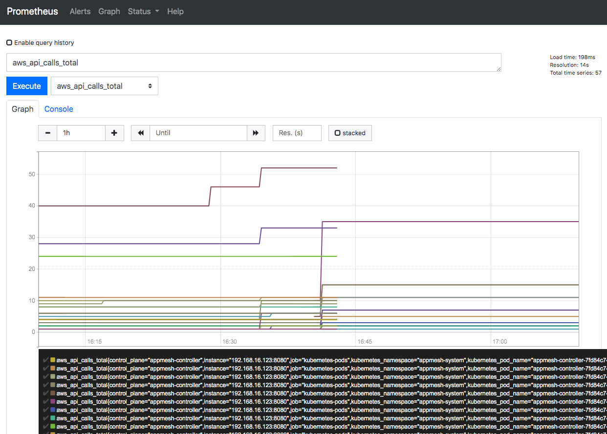

# App Mesh在EKS上的可观测性: Prometheus

注意：在开始本部分之前，请确保已完成带有EKS的App Mesh的[环境搭建](base.md)。换而言之，以下假设已配置了App Mesh的EKS群集可用，并且满足先决条件（aws，kubectl，jq等）。

Prometheus是一个系统和服务监视系统。它以设定时间间隔从目标收集指标，匹配规则表达式并显示结果。您可以将Prometheus与AWS App Mesh一起使用，以监控服务网格中应用程序。您还可以监控App Mesh Kubernetes Controller的指标。

## 安装

### 选项 1: 快速开始


App Mesh提供了预先的集成，可使用Helm快速部署与 App Mesh 集成的 Prometheus：
```
helm upgrade -i appmesh-prometheus eks/appmesh-prometheus \
--namespace appmesh-system
```

如果想对 Helm charts 进行更多的配置，可以参考：[appmesh-prometheus](https://github.com/aws/eks-charts/blob/master/stable/appmesh-prometheus/README.md)

### 选项 2: 使用已经存在的Promotheus

如果您已经安装了Prometheus，并且对Prometheus scrape配置的详细信息感兴趣，则可以在[此处](https://github.com/aws/eks-charts/blob/master/stable/appmesh-prometheus/templates/config.yaml)找到。具体来说，Envoy Sidecar的抓取配置：

```
    - job_name: 'appmesh-envoy'
      metrics_path: /stats/prometheus
      kubernetes_sd_configs:
      - role: pod
      relabel_configs:
      - source_labels: [__meta_kubernetes_pod_container_name]
        action: keep
        regex: '^envoy$'
      - source_labels: [__address__, __meta_kubernetes_pod_annotation_prometheus_io_port]
        action: replace
        regex: ([^:]+)(?::\d+)?;(\d+)
        replacement: ${1}:9901
        target_label: __address__
      - action: labelmap
        regex: __meta_kubernetes_pod_label_(.+)
      - source_labels: [__meta_kubernetes_namespace]
        action: replace
        target_label: kubernetes_namespace
      - source_labels: [__meta_kubernetes_pod_name]
        action: replace
        target_label: kubernetes_pod_name
```

## 使用

对于测试或演示环境（选项1安装），您可以使用端口转发到Prometheus：

```
kubectl -n appmesh-system port-forward svc/appmesh-prometheus 9090:9090
```

Prometheus UI: http://localhost:9090/

要查看使用AWS API 调用App Mesh Kubernetes controller，请搜索`aws_api_calls_total`



同样，您可以在指标下拉列表中查看所有收集的指标（包括应用程序运行状况指标）

## 清除环境

```
helm delete appmesh-prometheus -n appmesh-system
```
