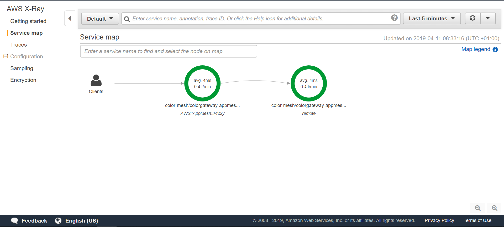
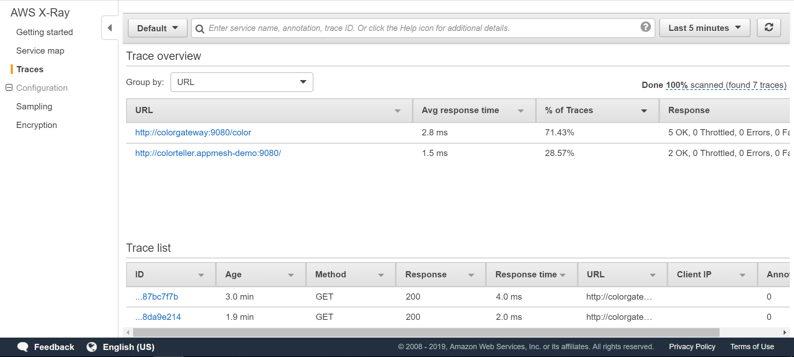
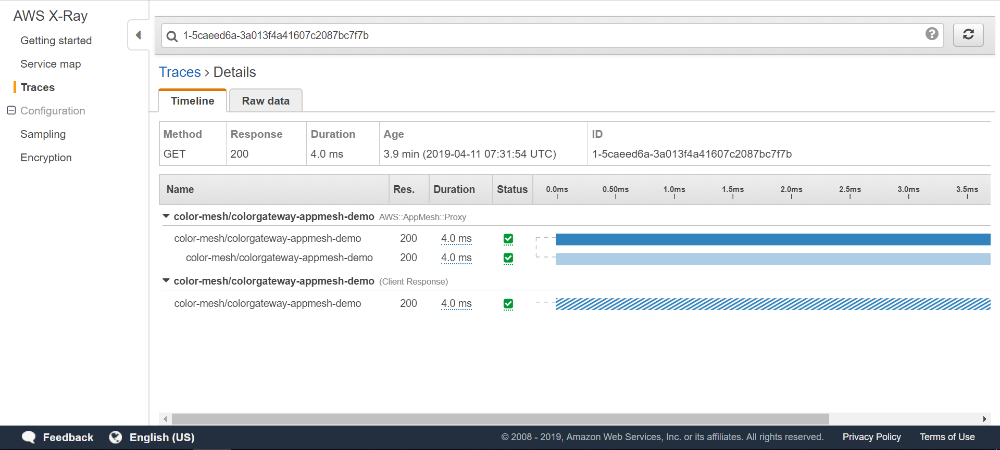

# App Mesh在EKS上的可观测性: X-Ray

注意：在开始本部分之前，请确保已完成带有EKS的App Mesh的[环境搭建](base.md)。 换句话说，以下假设已配置了App Mesh的EKS群集可用，并且满足先决条件（aws，kubectl，jq等）。

首先，将IAM策略`arn:aws-cn:iam::aws:policy/AWSXRayDaemonWriteAccess`附加到您的EKS集群的EC2 auto-scaling group组中。
要在亚马逊云科技中国区域要通过命令行附加IAM策略，请使用：
```
$ INSTANCE_PROFILE_PREFIX=$(aws cloudformation describe-stacks | jq -r '.Stacks[].StackName' | grep eksctl-appmeshtest-nodegroup-ng)
$ INSTANCE_PROFILE_NAME=$(aws iam list-instance-profiles | jq -r '.InstanceProfiles[].InstanceProfileName' | grep $INSTANCE_PROFILE_PREFIX)
$ ROLE_NAME=$(aws iam get-instance-profile --instance-profile-name $INSTANCE_PROFILE_NAME | jq -r '.InstanceProfile.Roles[] | .RoleName')
$ aws iam attach-role-policy \
      --role-name $ROLE_NAME \
      --policy arn:aws-cn:iam::aws:policy/AWSXRayDaemonWriteAccess
```

如果是AWS其他区域：
```
$ INSTANCE_PROFILE_PREFIX=$(aws cloudformation describe-stacks | jq -r '.Stacks[].StackName' | grep eksctl-appmeshtest-nodegroup-ng)
$ INSTANCE_PROFILE_NAME=$(aws iam list-instance-profiles | jq -r '.InstanceProfiles[].InstanceProfileName' | grep $INSTANCE_PROFILE_PREFIX)
$ ROLE_NAME=$(aws iam get-instance-profile --instance-profile-name $INSTANCE_PROFILE_NAME | jq -r '.InstanceProfile.Roles[] | .RoleName')
$ aws iam attach-role-policy \
      --role-name $ROLE_NAME \
      --policy arn:aws:iam::aws:policy/AWSXRayDaemonWriteAccess
```

启用App Mesh数据平面的X-Ray tracing

```sh
helm upgrade -i appmesh-controller eks/appmesh-controller \
    --namespace appmesh-system \
    --set region=$AWS_DEFAULT_REGION \
    --set serviceAccount.create=false \
    --set serviceAccount.name=appmesh-controller \
    --set image.repository=961992271922.dkr.ecr.cn-northwest-1.amazonaws.com.cn/amazon/appmesh-controller \
    --set init.image.repository=919830735681.dkr.ecr.cn-northwest-1.amazonaws.com.cn/aws-appmesh-proxy-route-manager \
    --set init.iamge.tag=v4-prod \
    --set sidecar.image.repository=919830735681.dkr.ecr.cn-northwest-1.amazonaws.com.cn/aws-appmesh-envoy \
    --set sidecar.image.tag=v1.20.0.0-prod \
    --set tracing.enabled=true \
    --set tracing.provider=x-ray
```

X-Ray守护程序由[App Mesh Controller](https://github.com/aws/aws-app-mesh-controller-for-k8s) 自动注入到您的应用容器中。使用以下命令进行验证：

```
$ kubectl -n appmesh-demo \
          get pods
NAME                                 READY   STATUS    RESTARTS   AGE
colorgateway-69cd4fc669-p6qhn        3/3     Running   0          11m
colorteller-845959f54-4cj5v          3/3     Running   0          11m
colorteller-black-6cc98458db-pqbv6   3/3     Running   0          11m
colorteller-blue-88bcffddb-6bmlt     3/3     Running   0          11m
colorteller-red-6f55b447db-2ht5k     3/3     Running   0          11m
```

您在`READY` 列中看到`3`了吗？这意味着每个吊舱中运行着三个容器：应用程序容器本身，作为App Mesh数据平面一部分的Envoy，以及将跟踪信息提供给X-Ray服务的X-Ray代理。

我们现在可以看到整个[service map](https://docs.aws.amazon.com/xray/latest/devguide/xray-console.html#xray-console-servicemap)呈现了服务的调用线路：



我们可以看到[跟踪](https://docs.aws.amazon.com/xray/latest/devguide/xray-concepts.html#xray-concepts-traces)，这代表了沿着请求路径的服务调用：



跟踪的详细视图：


