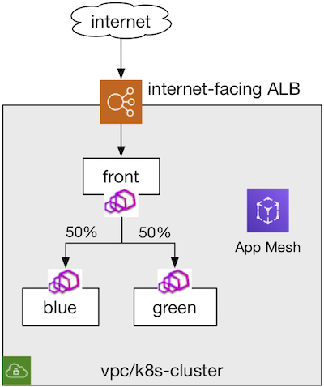

## 概述

本实验会介绍如何将App Mesh的虚拟节点(vitual-nodes)注册为[ALB Ingress Controller](https://github.com/kubernetes-sigs/aws-alb-ingress-controller)的目标。



## 前提条件
- [Walkthrough: App Mesh with EKS](../eks/)
- 安装Docker，示例需要构建演示应用的Docker image。

## 部署

1. 克隆此仓库，然后进入`howto-k8s-alb`文件夹，所有的命令都是在此文件夹下运行。
2. **你的** account id:
    ```
    export AWS_ACCOUNT_ID=<your_account_id>
    ```
3. **Region** e.g. cn-northwest-1
    ```
    export AWS_DEFAULT_REGION=cn-northwest-1
    ```
4. **(可选项) 指定 Envoy Image 版本** 如果要使用与[默认版本](https://github.com/aws/eks-charts/tree/master/stable/appmesh-controller#configuration)不同的Envoy 容器镜像，运行 `helm upgrade` 去覆盖 `sidecar.image.repository` 和 `sidecar.image.tag` 字段。
5. **安装 AWS Loadbalancer Controller**
    ```
    export VPC_ID=<vpc_id>

    # 创建 AWS Load Balancer Controller 所需的 IAM 策略
    curl -o iam-policy.json \
        https://raw.githubusercontent.com/kubernetes-sigs/aws-load-balancer-controller/v2.2.1/docs/install/iam_policy.json
    sed "s/arn:aws:/arn:aws-cn:/g" iam-policy.json > iam-policy-cn.json
    aws iam create-policy \
        --policy-name AWSLoadBalancerControllerIAMPolicy \
        --policy-document file://iam-policy-cn.json

    # 创建 AWS Load Balancer Controller 所需的IAM角色
    eksctl create iamserviceaccount \
        --cluster=appmeshtest \
        --namespace=kube-system \
        --name=aws-load-balancer-controller \
        --attach-policy-arn=arn:aws:iam::$AWS_ACCOUNT_ID:policy/AWSLoadBalancerControllerIAMPolicy \
        --override-existing-serviceaccounts \
        --approve
    如果是亚马逊云科技中国区域，使用：
    eksctl create iamserviceaccount \
        --cluster=appmeshtest \
        --namespace=kube-system \
        --name=aws-load-balancer-controller \
        --attach-policy-arn=arn:aws-cn:iam::$AWS_ACCOUNT_ID:policy/AWSLoadBalancerControllerIAMPolicy \
        --override-existing-serviceaccounts \
        --approve

    # 安装 AWS Load Balancer Controller CRDS
    kubectl apply -k \
        "github.com/aws/eks-charts/stable/aws-load-balancer-controller//crds?ref=master"

    # 安装 AWS Load Balancer Controller
    helm install aws-load-balancer-controller \
        eks/aws-load-balancer-controller -n kube-system \
        --set clusterName=appmeshtest \
        --set serviceAccount.create=false \
        --set serviceAccount.name=aws-load-balancer-controller \
        --set vpcId=$VPC_ID \
        --set region=$AWS_DEFAULT_REGION \
        --set image.repository=961992271922.dkr.ecr.cn-northwest-1.amazonaws.com.cn/amazon/aws-load-balancer-controller
    ```
6. 部署
    ```.
    ./deploy.sh
    ```

## 使用

检查Ingress的事件，查看变化。

    ```
    kubectl describe ing -n howto-k8s-alb color
    ```

您应该会看到类似于以下内容。

    ```
    Name:             color
    Namespace:        howto-k8s-alb
    Address:          k8s-howtok8s-color-63786f35e6-804246232.cn-northwest-1.elb.amazonaws.com.cn
    Default backend:  default-http-backend:80 (<error: endpoints "default-http-backend" not found>)
    Rules:
    Host        Path  Backends
    ----        ----  --------
    *
                /color   front:8080 (192.168.55.156:8080,192.168.58.190:8080,192.168.79.111:8080 + 2 more...)
    Annotations:  alb.ingress.kubernetes.io/healthcheck-path: /color
                alb.ingress.kubernetes.io/listen-ports: [{"HTTP": 10080}]
                alb.ingress.kubernetes.io/scheme: internet-facing
                alb.ingress.kubernetes.io/target-type: ip
                kubernetes.io/ingress.class: alb
    Events:
    Type    Reason                  Age    From     Message
    ----    ------                  ----   ----     -------
    Normal  SuccessfullyReconciled  3m18s  ingress  Successfully reconciled
     ```

稍等几分钟后，检查是否可以通过ALB Ingress Controller访问该应用程序。

```
curl -v k8s-howtok8s-color-63786f35e6-804246232.cn-northwest-1.elb.amazonaws.com.cn:10080/color
```

您应该看到类似于以下内容。

```
*   Trying 34.208.158.34...
* TCP_NODELAY set
* Connected to k8s-howtok8s-color-63786f35e6-804246232.cn-northwest-1.elb.amazonaws.com.cn (34.208.158.34) port 80 (#0)
> GET /color HTTP/1.1> Host: k8s-howtok8s-color-63786f35e6-804246232.cn-northwest-1.elb.amazonaws.com.cn
> User-Agent: curl/7.61.1
> Accept: */*
>
< HTTP/1.1 200 OK
< Date: Sat, 09 May 2020 01:30:06 GMT
< Transfer-Encoding: chunked
< Connection: keep-alive
< server: envoy
< x-envoy-upstream-service-time: 0
<
* Connection #0 to host 80113f18-howtok8salb-color-0f20-319733316.us-west-2.elb.amazonaws.com left intact
blue
```
